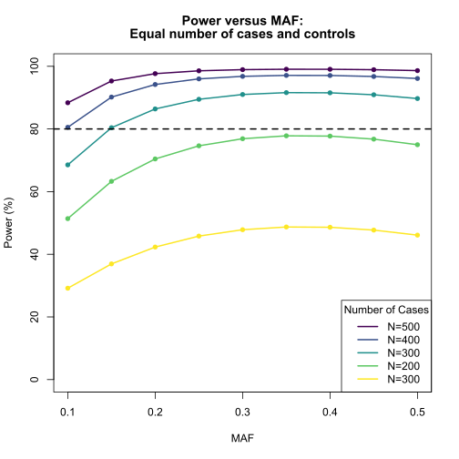
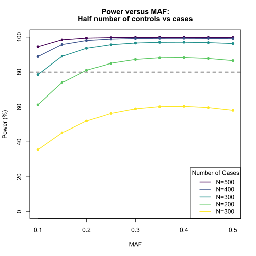

### Description:  
Power calculation for testing disease associated with marker in a case-control study.  

***  
**Code:**  
Directory:  
 
> &nbsp;&nbsp;&nbsp;&nbsp;/mnt/research/NMDL/Power  
  
R Script:  
 
> &nbsp;&nbsp;&nbsp;&nbsp;Power.R  
 
**Output files:**  
 
> &nbsp;&nbsp;&nbsp;&nbsp;power_function.Rdata  
  
***  
### Code  
Clear Environment


```r
rm(list=ls())
```

**Load required packages**


```r
library(GeneticsDesign)
library(viridis)
```

```
## Loading required package: viridisLite
```

**Session Information**


```r
sessionInfo()
```

```
## R version 3.5.1 (2018-07-02)
## Platform: x86_64-pc-linux-gnu (64-bit)
## Running under: CentOS Linux 7 (Core)
## 
## Matrix products: default
## BLAS/LAPACK: /opt/software/OpenBLAS/0.2.20-GCC-6.4.0-2.28/lib/libopenblas_haswellp-r0.2.20.so
## 
## locale:
##  [1] LC_CTYPE=en_US.UTF-8       LC_NUMERIC=C              
##  [3] LC_TIME=en_US.UTF-8        LC_COLLATE=en_US.UTF-8    
##  [5] LC_MONETARY=en_US.UTF-8    LC_MESSAGES=en_US.UTF-8   
##  [7] LC_PAPER=en_US.UTF-8       LC_NAME=C                 
##  [9] LC_ADDRESS=C               LC_TELEPHONE=C            
## [11] LC_MEASUREMENT=en_US.UTF-8 LC_IDENTIFICATION=C       
## 
## attached base packages:
## [1] stats     graphics  grDevices utils     datasets  methods   base     
## 
## other attached packages:
## [1] viridis_0.5.1         viridisLite_0.3.0     GeneticsDesign_1.48.0
## [4] knitr_1.20           
## 
## loaded via a namespace (and not attached):
##  [1] Rcpp_0.12.17     magrittr_1.5     gmodels_2.16.2   MASS_7.3-50     
##  [5] munsell_0.5.0    colorspace_1.3-2 rlang_0.2.1      stringr_1.3.1   
##  [9] plyr_1.8.4       tools_3.5.1      grid_3.5.1       gtable_0.2.0    
## [13] gtools_3.5.0     lazyeval_0.2.1   tibble_1.4.2     gridExtra_2.3   
## [17] ggplot2_2.2.1    evaluate_0.10.1  gdata_2.18.0     stringi_1.2.3   
## [21] compiler_3.5.1   pillar_1.2.3     scales_0.5.0     mvtnorm_1.0-8
```

### Description:  
The following is a sample code to get a table of power for different combinations of
high risk allele frequency P r(A) and genotype relative risk RR(Aa|aa). 
Risk allele frequency  


```r
PA <- seq(from=0.1, to=0.5, by=0.05)
PA
```

```
## [1] 0.10 0.15 0.20 0.25 0.30 0.35 0.40 0.45 0.50
```

Relative Risk of disease (1%, 25%, 50%, 75%, 100%)


```r
RR <- c(1.01, 1.25, 1.5, 1.75, 2.0)
```

Function to calculate the power a genetic design given the frequency of risk allele, genotype relative risk, 
and number of casses and controls.


```r
pow <- function(PA, RR, case, control){

    lenPA <- length(PA)
    lenRR <- length(RR)

    mat <- matrix(0, nrow=lenPA, ncol=lenRR)
    rownames(mat) <- paste("MAF=", formatC(PA, format="f", digits=2), sep="")
    colnames(mat) <- paste("RRAA=", RR, sep="")

    for(i in 1:lenPA){ 
        a <- PA[i]

        for(j in 1:lenRR){
            b <- RR[j]
            res <- GPC.default(pA=a, pD=0.1, RRAa=(1+b)/2, RRAA=b, 
                Dprime=1, pB=a, nCase=case, ratio=control/case, quiet=T)

            mat[i,j] <- res$power
        }
    }
    return(mat)
}
```

### Power table for different number of cases.  
> Assuming 500 case and 500 controls


```r
rst5 <- pow(PA, RR, case=500, control=500)
print(round(rst5,3))
```

```
##          RRAA=1.01 RRAA=1.25 RRAA=1.5 RRAA=1.75 RRAA=2
## MAF=0.10      0.05     0.145    0.400     0.690  0.884
## MAF=0.15      0.05     0.183    0.514     0.814  0.953
## MAF=0.20      0.05     0.214    0.594     0.877  0.977
## MAF=0.25      0.05     0.240    0.647     0.909  0.986
## MAF=0.30      0.05     0.259    0.682     0.926  0.989
## MAF=0.35      0.05     0.272    0.702     0.934  0.991
## MAF=0.40      0.05     0.280    0.711     0.936  0.990
## MAF=0.45      0.05     0.283    0.711     0.933  0.989
## MAF=0.50      0.05     0.282    0.702     0.925  0.986
```

> Assuming 400 case and 400 controls


```r
rst4 <- pow(PA, RR, case=400, control=400)
print(round(rst4,3))
```

```
##          RRAA=1.01 RRAA=1.25 RRAA=1.5 RRAA=1.75 RRAA=2
## MAF=0.10      0.05     0.125    0.332     0.594  0.805
## MAF=0.15      0.05     0.155    0.430     0.723  0.902
## MAF=0.20      0.05     0.181    0.502     0.796  0.942
## MAF=0.25      0.05     0.201    0.552     0.838  0.960
## MAF=0.30      0.05     0.216    0.586     0.862  0.968
## MAF=0.35      0.05     0.227    0.606     0.873  0.971
## MAF=0.40      0.05     0.234    0.615     0.876  0.971
## MAF=0.45      0.05     0.236    0.614     0.871  0.967
## MAF=0.50      0.05     0.235    0.605     0.860  0.961
```

> Assuming 300 case and 300 controls


```r
rst3 <- pow(PA, RR, case=300, control=300)
print(round(rst3,3))
```

```
##          RRAA=1.01 RRAA=1.25 RRAA=1.5 RRAA=1.75 RRAA=2
## MAF=0.10      0.05     0.106    0.262     0.477  0.685
## MAF=0.15      0.05     0.129    0.339     0.599  0.804
## MAF=0.20      0.05     0.147    0.398     0.676  0.864
## MAF=0.25      0.05     0.162    0.441     0.723  0.895
## MAF=0.30      0.05     0.174    0.470     0.751  0.910
## MAF=0.35      0.05     0.182    0.488     0.766  0.916
## MAF=0.40      0.05     0.187    0.496     0.769  0.915
## MAF=0.45      0.05     0.189    0.496     0.764  0.909
## MAF=0.50      0.05     0.188    0.487     0.750  0.897
```

> Assuming 200 case and 00 controls


```r
rst2 <- pow(PA, RR, case=200, control=200)
print(round(rst2,3))
```

```
##          RRAA=1.01 RRAA=1.25 RRAA=1.5 RRAA=1.75 RRAA=2
## MAF=0.10      0.05     0.087    0.190     0.343  0.514
## MAF=0.15      0.05     0.102    0.243     0.438  0.633
## MAF=0.20      0.05     0.114    0.284     0.505  0.704
## MAF=0.25      0.05     0.124    0.315     0.549  0.746
## MAF=0.30      0.05     0.132    0.337     0.577  0.769
## MAF=0.35      0.05     0.137    0.351     0.592  0.778
## MAF=0.40      0.05     0.140    0.357     0.595  0.777
## MAF=0.45      0.05     0.142    0.356     0.590  0.768
## MAF=0.50      0.05     0.141    0.350     0.576  0.750
```

> Assuming 100 case and 100 controls


```r
rst1 <- pow(PA, RR, case=100, control=100)
print(round(rst1,3))
```

```
##          RRAA=1.01 RRAA=1.25 RRAA=1.5 RRAA=1.75 RRAA=2
## MAF=0.10      0.05     0.068    0.119     0.196  0.292
## MAF=0.15      0.05     0.076    0.145     0.247  0.369
## MAF=0.20      0.05     0.082    0.166     0.286  0.423
## MAF=0.25      0.05     0.087    0.182     0.314  0.458
## MAF=0.30      0.05     0.090    0.193     0.332  0.478
## MAF=0.35      0.05     0.093    0.200     0.341  0.487
## MAF=0.40      0.05     0.094    0.203     0.343  0.486
## MAF=0.45      0.05     0.095    0.203     0.340  0.477
## MAF=0.50      0.05     0.095    0.200     0.331  0.461
```

### Power table for different number of cases and 50% less controls.  
> Assuming 500 case and 500 controls


```r
rst5.5 <- pow(PA, RR, case=500, control=1000)
print(round(rst5.5,3))
```

```
##          RRAA=1.01 RRAA=1.25 RRAA=1.5 RRAA=1.75 RRAA=2
## MAF=0.10     0.050     0.175    0.492     0.794  0.944
## MAF=0.15     0.050     0.225    0.623     0.899  0.984
## MAF=0.20     0.050     0.267    0.709     0.944  0.994
## MAF=0.25     0.050     0.301    0.764     0.965  0.997
## MAF=0.30     0.050     0.326    0.798     0.974  0.998
## MAF=0.35     0.051     0.344    0.818     0.979  0.999
## MAF=0.40     0.051     0.355    0.827     0.980  0.999
## MAF=0.45     0.051     0.360    0.828     0.979  0.998
## MAF=0.50     0.051     0.358    0.821     0.976  0.998
```

> Assuming 400 case and 200 controls


```r
rst4.5 <- pow(PA, RR, case=400, control=800)
print(round(rst4.5,3))
```

```
##          RRAA=1.01 RRAA=1.25 RRAA=1.5 RRAA=1.75 RRAA=2
## MAF=0.10      0.05     0.149    0.411     0.700  0.888
## MAF=0.15      0.05     0.190    0.530     0.825  0.957
## MAF=0.20      0.05     0.223    0.612     0.888  0.980
## MAF=0.25      0.05     0.250    0.668     0.921  0.989
## MAF=0.30      0.05     0.271    0.705     0.937  0.992
## MAF=0.35      0.05     0.286    0.727     0.946  0.993
## MAF=0.40      0.05     0.295    0.738     0.948  0.994
## MAF=0.45      0.05     0.299    0.739     0.947  0.993
## MAF=0.50      0.05     0.297    0.731     0.941  0.991
```

> Assuming 300 case and 300 controls


```r
rst3.5 <- pow(PA, RR, case=300, control=600)
print(round(rst3.5,3))
```

```
##          RRAA=1.01 RRAA=1.25 RRAA=1.5 RRAA=1.75 RRAA=2
## MAF=0.10      0.05     0.124    0.324     0.576  0.785
## MAF=0.15      0.05     0.154    0.422     0.708  0.890
## MAF=0.20      0.05     0.179    0.494     0.786  0.935
## MAF=0.25      0.05     0.200    0.546     0.831  0.956
## MAF=0.30      0.05     0.215    0.581     0.857  0.966
## MAF=0.35      0.05     0.226    0.603     0.870  0.970
## MAF=0.40      0.05     0.233    0.613     0.875  0.971
## MAF=0.45      0.05     0.236    0.614     0.872  0.968
## MAF=0.50      0.05     0.235    0.607     0.863  0.963
```

> Assuming 200 case and 200 controls


```r
rst2.5 <- pow(PA, RR, case=200, control=400)
print(round(rst2.5,3))
```

```
##          RRAA=1.01 RRAA=1.25 RRAA=1.5 RRAA=1.75 RRAA=2
## MAF=0.10      0.05     0.099    0.232     0.420  0.612
## MAF=0.15      0.05     0.119    0.301     0.535  0.739
## MAF=0.20      0.05     0.135    0.355     0.613  0.810
## MAF=0.25      0.05     0.149    0.395     0.664  0.849
## MAF=0.30      0.05     0.159    0.423     0.695  0.870
## MAF=0.35      0.05     0.166    0.441     0.712  0.880
## MAF=0.40      0.05     0.171    0.451     0.718  0.881
## MAF=0.45      0.05     0.173    0.451     0.715  0.876
## MAF=0.50      0.05     0.172    0.445     0.703  0.864
```

> Assuming 100 case and 100 controls


```r
rst1.5 <- pow(PA, RR, case=100, control=200)
print(round(rst1.5,3))
```

```
##          RRAA=1.01 RRAA=1.25 RRAA=1.5 RRAA=1.75 RRAA=2
## MAF=0.10      0.05     0.074    0.140     0.237  0.355
## MAF=0.15      0.05     0.084    0.174     0.305  0.452
## MAF=0.20      0.05     0.092    0.202     0.355  0.519
## MAF=0.25      0.05     0.098    0.224     0.392  0.562
## MAF=0.30      0.05     0.104    0.239     0.416  0.589
## MAF=0.35      0.05     0.107    0.249     0.430  0.601
## MAF=0.40      0.05     0.109    0.255     0.434  0.603
## MAF=0.45      0.05     0.110    0.255     0.432  0.596
## MAF=0.50      0.05     0.110    0.251     0.422  0.580
```

### Merge results for relative risk of disease equal to 2 (100%) for risk allele given different number of case and controls  
> Equal number of case and controls


```r
test1 <- data.frame(N500=rst5[,5], N400=rst4[,5], N300=rst3[,5], N200=rst2[,5], N100=rst1[,5])
# Save power table
write.table(test1, file=paste(getwd(), "power_equal.txt", sep="/"), 
    row.names=TRUE, col.names=TRUE, quote=FALSE, sep="\t")
print(round(test1,2)*100)
```

```
##          N500 N400 N300 N200 N100
## MAF=0.10   88   81   69   51   29
## MAF=0.15   95   90   80   63   37
## MAF=0.20   98   94   86   70   42
## MAF=0.25   99   96   89   75   46
## MAF=0.30   99   97   91   77   48
## MAF=0.35   99   97   92   78   49
## MAF=0.40   99   97   92   78   49
## MAF=0.45   99   97   91   77   48
## MAF=0.50   99   96   90   75   46
```

> Half the number of controls than cases


```r
test2 <- data.frame(N500=rst5.5[,5], N400=rst4.5[,5], N300=rst3.5[,5], N200=rst2.5[,5], N100=rst1.5[,5])
# Save power table
write.table(test2, file=paste(getwd(), "power_unequal.txt", sep="/"), 
    row.names=TRUE, col.names=TRUE, quote=FALSE, sep="\t")
print(round(test2,2)*100)
```

```
##          N500 N400 N300 N200 N100
## MAF=0.10   94   89   79   61   36
## MAF=0.15   98   96   89   74   45
## MAF=0.20   99   98   94   81   52
## MAF=0.25  100   99   96   85   56
## MAF=0.30  100   99   97   87   59
## MAF=0.35  100   99   97   88   60
## MAF=0.40  100   99   97   88   60
## MAF=0.45  100   99   97   88   60
## MAF=0.50  100   99   96   86   58
```

### Plot Power  


```r
color <- viridis(ncol(test1))
plot(y=test1[,1], x=PA, main=c("Power versus MAF:","Equal number of cases and controls"), 
    xlab="MAF", ylab="Power (%)", type="n", ylim=c(0,100))
for (i in 1:ncol(test1)){
    points(y=test1[,i]*100, x=PA, col=color[i], pch=16)
    lines(y=test1[,i]*100, x=PA, col=color[i], lty=1, lwd=2)
}
legend("bottomright", legend=c("N=500", "N=400", "N=300", "N=200", "N=300"), title="Number of Cases",
    lty=rep(1, ncol(test1)), lwd=rep(2, ncol(test1)), col=viridis(ncol(test1)), ncol=1, horiz=FALSE)
abline(h=80, col="black", lty=2, lwd=2)
```



```r
color <- viridis(ncol(test2))
plot(y=test2[,1], x=PA, main=c("Power versus MAF:","Half number of controls vs cases"), 
    xlab="MAF", ylab="Power (%)", type="n", ylim=c(0,100))
for (i in 1:ncol(test2)){
    points(y=test2[,i]*100, x=PA, col=color[i], pch=16)
    lines(y=test2[,i]*100, x=PA, col=color[i], lty=1, lwd=2)
}
legend("bottomright", legend=c("N=500", "N=400", "N=300", "N=200", "N=300"), title="Number of Cases",
    lty=rep(1, ncol(test2)), lwd=rep(2, ncol(test2)), col=viridis(ncol(test2)), ncol=1, horiz=FALSE)
abline(h=80, col="black", lty=2, lwd=2)
```



### Run R Script  


```r
htmlRunR
Power.R nodes=1,cpus-per-task=1,time=00:20:00,mem=10G +Power Table
```

